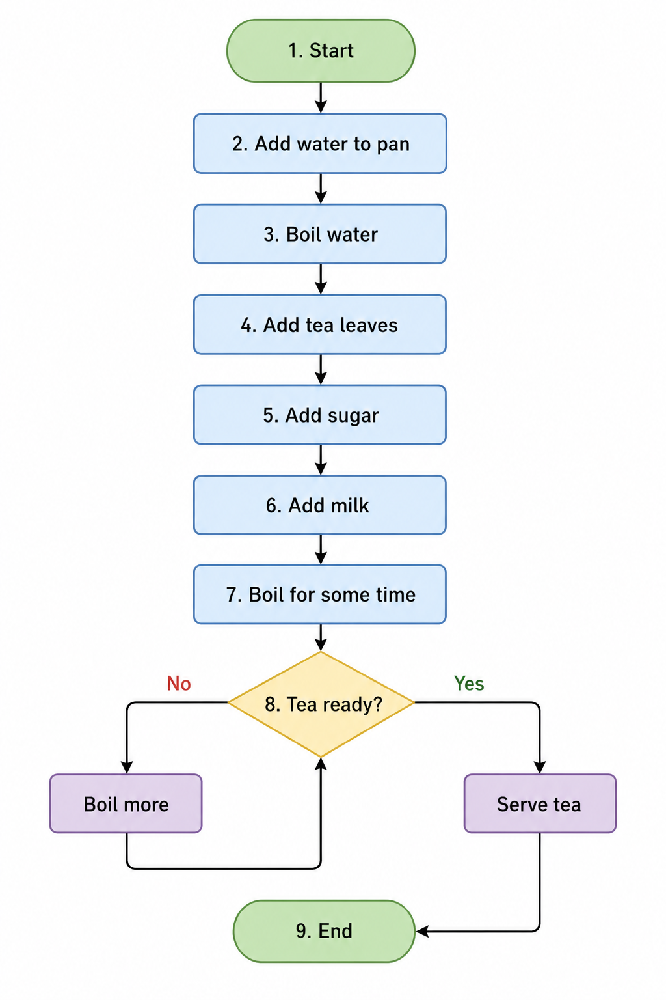

# Add Two Numbers Flowchart ➕

## Problem

Add two numbers A and B and display the result.

---

## Steps (Algorithm Thinking)

1. Start
2. Input A, B
3. Calculate Sum = A + B
4. Display Sum
5. End

---

## Flowchart Diagram

*Reference: Basic flowchart showing input, process, and output.*

---

## Flowchart (Text Representation)

Start
↓
Input A, B
↓
Sum = A + B
↓
Display Sum
↓
End

---

## Understanding

* Uses **Input/Output symbol (parallelogram)**
* Simple **process step (addition)**
* No decision involved

---

## Mistakes I made

* Forgot to take input
* Printed wrong variable
* Skipped output step

---

## Key Takeaway

Every program follows this pattern:
**Input → Process → Output**
