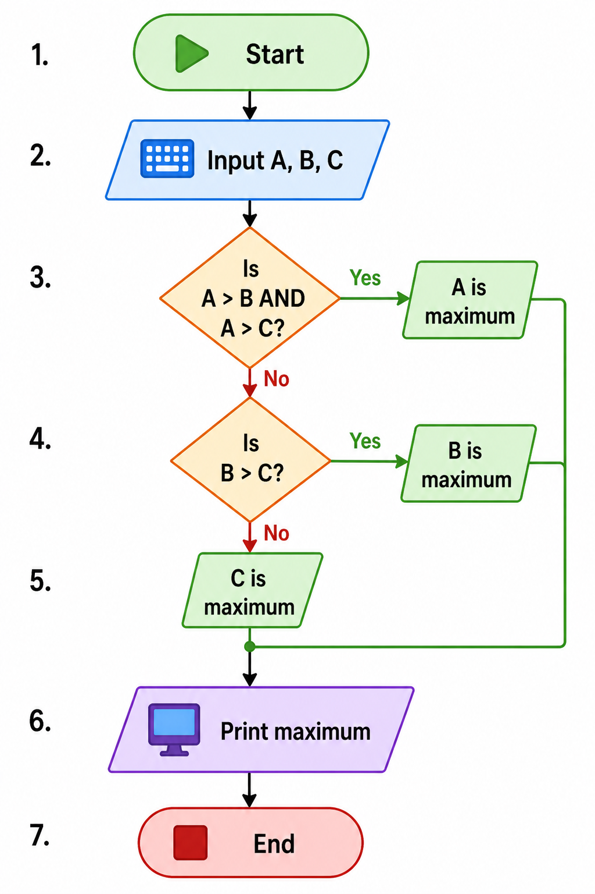

# Max of Three Numbers Flowchart 

## Problem

Find the maximum among three numbers A, B, and C.

---

## Steps (Algorithm Thinking)

1. Start
2. Input A, B, C
3. If A > B AND A > C → A is maximum
4. Else if B > C → B is maximum
5. Else → C is maximum
6. Print maximum
7. End

---

## Flowchart Diagram

*Reference: Standard flowchart to find the largest of three numbers.*

---

## Flowchart (Text Representation)

Start
↓
Input A, B, C
↓
A > B AND A > C ?
→ Yes → Print A → End
→ No ↓
B > C ?
→ Yes → Print B → End
→ No → Print C → End

---

## Understanding

* Uses **multiple decision conditions**
* First checks A, then B
* Covers all possible cases
* Ensures one maximum is always found

---

## Mistakes I made

* Forgot to use AND condition
* Missed edge cases
* Incorrect comparison order

---

## Key Takeaway

Breaking problems into conditions (if-else logic) is the foundation of programming.
