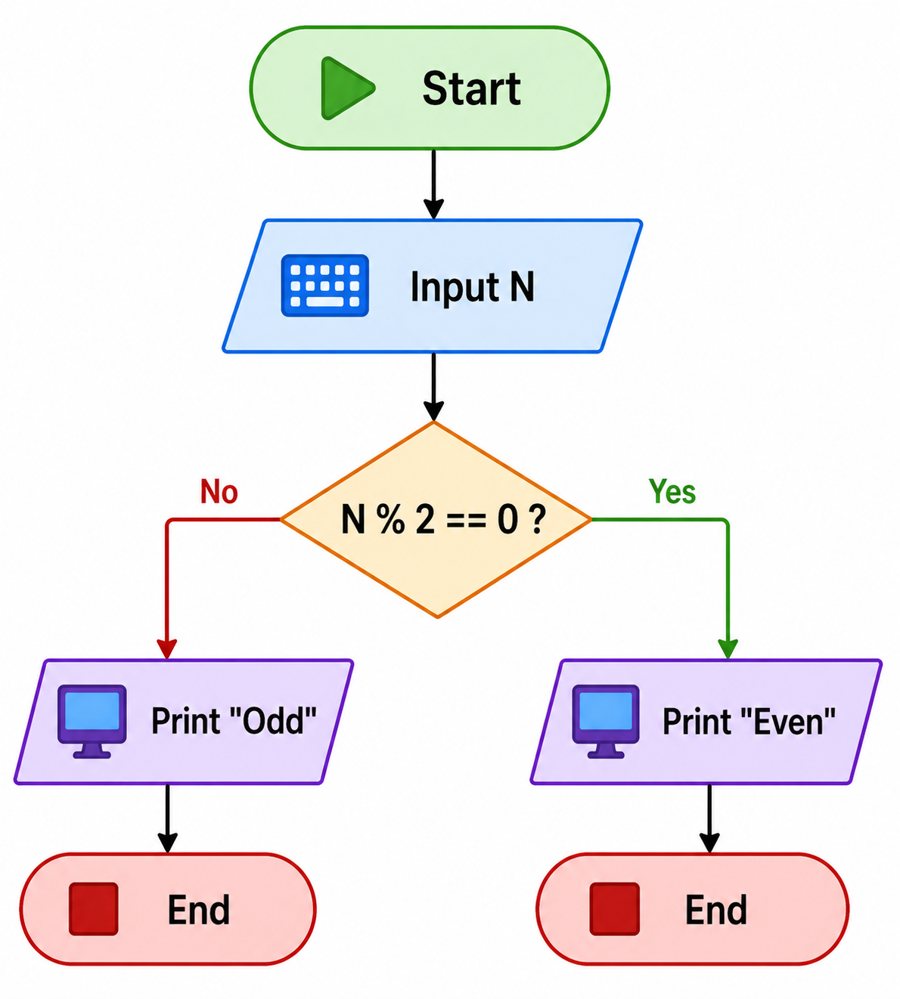

# Odd Even Flowchart 

## Problem

Check whether a number is Odd or Even.

---

## Logic

A number is:

* Even if divisible by 2
* Odd if not divisible by 2

---

## Steps (Algorithm Thinking)

1. Start
2. Input number N
3. Check N % 2 == 0

   * Yes → Even
   * No → Odd
4. Display result
5. End

---

## Flowchart Diagram

*Reference: Flowchart using decision (diamond) to check divisibility.*

---

## Flowchart (Text Representation)

Start
↓
Input N
↓
N % 2 == 0 ?
→ Yes → Print "Even" → End
→ No → Print "Odd" → End

---

## Understanding

* Uses **modulus operator (%)**
* Introduces **decision making (if-else logic)**
* One condition → two outcomes

---

## Mistakes I made

* Used wrong condition
* Forgot modulus operator
* Mixed up even and odd logic

---

## Key Takeaway

Decision-making (if-else) is the foundation of programming logic.
