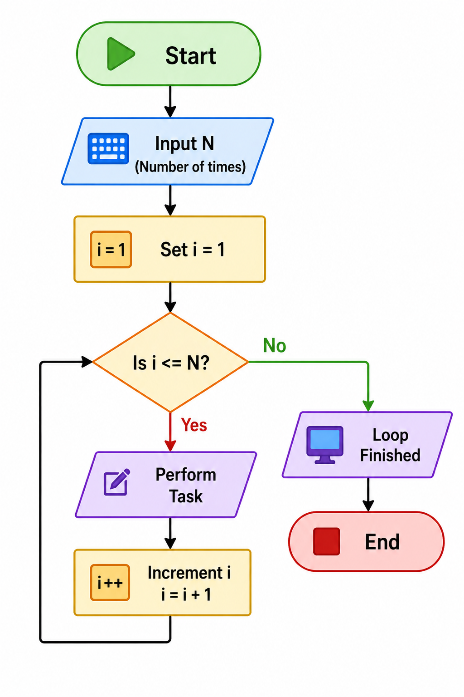

# Loops Flowchart 🔁

## What is a Loop?

A loop is used to repeat a set of steps again and again until a condition becomes false.

---

## Simple Example

Print numbers from 1 to 5.

---

## Steps (Algorithm Thinking)

1. Start
2. Set i = 1
3. Check i ≤ 5

   * Yes → Print i → Increase i by 1 → Go back to step 3
   * No → End

---

## Flowchart Diagram

*Reference: Flowchart showing repetition using a loop.*

---

## Flowchart (Text Representation)

Start
↓
i = 1
↓
i ≤ 5 ?
→ Yes → Print i → i = i + 1 → (go back)
→ No → End

---

## Understanding (Simple Language)

* Loop means repeating steps
* Condition is checked every time
* Loop stops when condition becomes false

---

## Types of Loops (Basic Idea)

* **While Loop** → checks condition first, then runs
* **For Loop** → used when number of repetitions is known
* **Do-While Loop** → runs at least once, then checks condition

---

## Real Life Example

Brushing teeth for 2 minutes:

* Start brushing
* Keep brushing while time < 2 minutes
* Stop when time is over

---

## Important Concept

If the condition never becomes false, the loop will run forever (infinite loop).

---

## Key Takeaway

Loop = Repeat steps until condition becomes false
