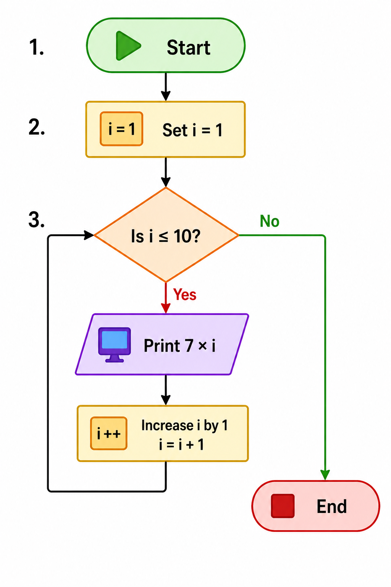

# Table of 7 Flowchart 🔢

## Problem

Print the table of 7.

---

## Steps (Algorithm Thinking)

1. Start
2. Set i = 1
3. Check i ≤ 10

   * Yes → Print 7 × i
   * Increase i by 1
   * Go back to step 3
   * No → End

---

## Flowchart Diagram

*Reference: Flowchart using loop to repeat steps.*

---

## Flowchart (Text Representation)

Start
↓
i = 1
↓
i ≤ 10 ?
→ Yes → Print 7 × i → i = i + 1 → (go back)
→ No → End

---

## Understanding

* Loop runs 10 times
* Each time multiplies 7 with i
* Prints values from 7 to 70

---

## Mistakes I made

* Used wrong condition (i < 10 instead of i ≤ 10)
* Forgot to increment i (infinite loop)
* Printed wrong value (i instead of 7 × i)
* Started i from 0 instead of 1

---

## Key Takeaway

Loops help in repeating calculations correctly with proper conditions.
