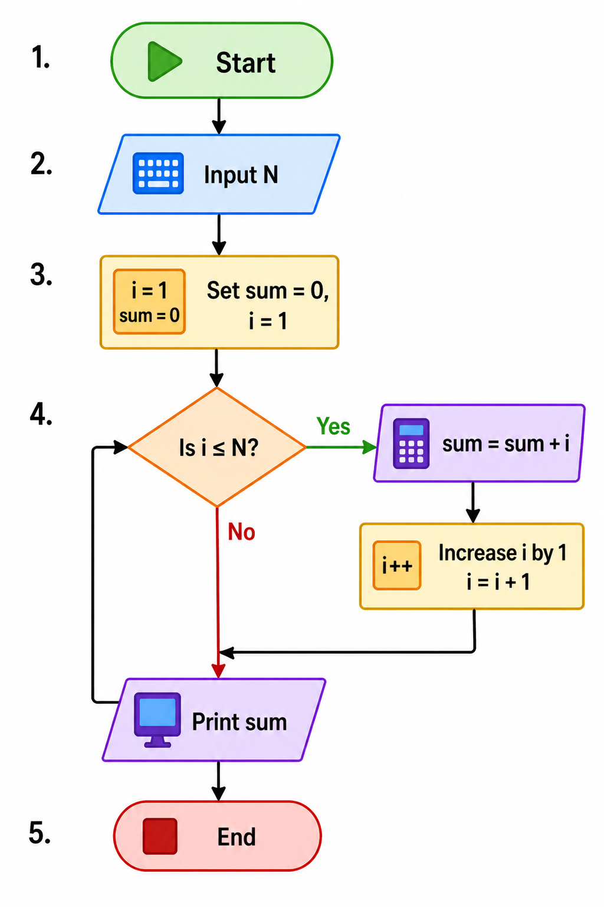

# Sum of First N Numbers Flowchart 

## Problem

Find the sum of first N natural numbers.

---

## Steps (Algorithm Thinking)

1. Start
2. Input N
3. Set sum = 0, i = 1
4. Check i ≤ N

   * Yes → sum = sum + i
   * Increase i by 1
   * Go back to step 4
   * No → Print sum
5. End

---

## Flowchart Diagram

*Reference: Flowchart using loop to calculate sum.*

---

## Flowchart (Text Representation)

Start
↓
Input N
↓
sum = 0, i = 1
↓
i ≤ N ?
→ Yes → sum = sum + i → i = i + 1 → (go back)
→ No → Print sum → End

---

## Understanding

* Loop runs N times
* Adds numbers from 1 to N
* Stores result in sum

---

## Mistakes I made

* Forgot to initialize sum = 0
* Used wrong condition
* Did not increment i
* Printed wrong variable

---

## Key Takeaway

Loops can be used to accumulate values step by step.
